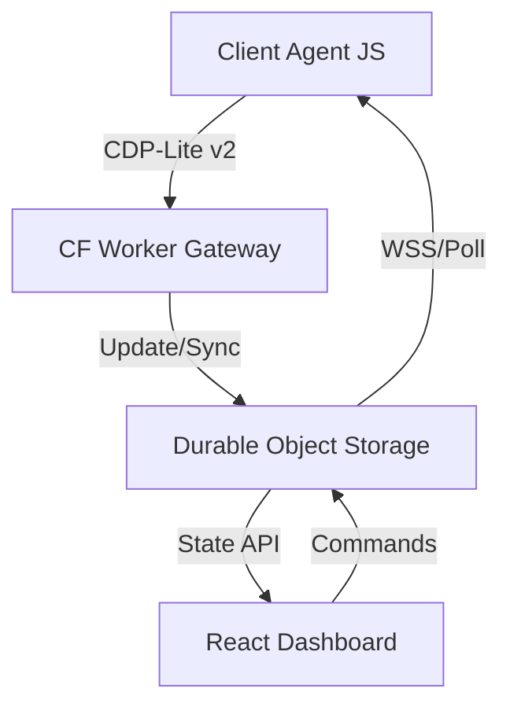

# Insidr Telemetry Control Plane v2.6 Enterprise
[]()
[]()
[]()
## Table of Contents
1. [System Overview](#system-overview)
2. [Telemetry Pipeline](#telemetry-pipeline)
3. [CDP-Lite v2 Protocol Specification](#cdp-lite-v2-protocol-specification)
4. [Security & Sandboxing](#security--sandboxing)
5. [Data Lifecycle & Compliance](#data-lifecycle--compliance)
---
## System Overview
Insidr is a high-integrity remote debugging platform designed for fleet-scale digital signage (webOS, Tizen, Android TV). It provides a real-time observability layer where traditional DevTools are unavailable.

---
## Telemetry Pipeline
### 1. Ingestion Hooks
The Agent (v2.6.1) implements zero-dependency hijacking of standard browser APIs:
- **Console**: Wraps `console.log/warn/error/info`. Captures stack traces and color codes.
- **Network**: Hooks `window.fetch` and `XMLHttpRequest`. Captures headers, status codes, and latency waterfalls.
- **Errors**: Listens for `window.onerror` and `unhandledrejection` events.
- **Performance**: Polls `performance.memory` (Chrome/webOS) and RAF-based FPS monitoring.
### 2. Buffering Strategy
- **In-Memory**: Default 50-event buffer.
- **Persistence**: Optional OPFS (Origin Private File System) or IndexedDB 50MB circular LRU for offline support.
- **Batching**: Transmits every 5s or when buffer hits 20 items.
---
## CDP-Lite v2 Protocol Specification
The platform utilizes a structured envelope to ensure reliable delivery over unstable signage networks.
### Envelope Structure
```typescript
interface CDPLiteV2 {
  version: "2.6.1";
  sessionId: string;   // Unique per page load
  sequence: number;    // Monotonic counter
  ackReq: boolean;     // Request server acknowledgement
  method: "telemetry" | "heartbeat" | "ack" | "event";
  params: {
    deviceId: string;
    payload: TelemetryData;
    timestamp: string;
  };
}
```
### Transport Modes
- **HTTP/S**: Standard POST ingestion with `X-Transport: JSON`.
- **WSS**: Low-latency binary-efficient stream (MsgPack supported).
---
## Security & Sandboxing
### Remote Command Execution
Commands issued from the Control Plane (e.g., `eval_sandbox`) are never executed directly in the Main Thread to prevent UI blocking or credential theft.
1. **DedicatedWorker**: Commands run in a sanitized Worker context.
2. **Restricted API**: Only the `insidrApi` global is exposed (getInfo, reload, clearCache).
3. **No DOM/eval**: Standard `eval` is disabled via CSP rejection logic in the gateway.
### Consent & Privacy
- **Privacy Gating**: Telemetry is only transmitted if `localStorage.getItem('insidr-consent') === 'true'`.
- **PII Redaction**: Automatic masking of sensitive keys (tokens, passwords, card numbers) before transmission.
---
## Data Lifecycle & Compliance
### Storage (Durable Object)
- **Memory Limit**: 128MB per global instance.
- **Circular Buffer**: Logs are capped at 500 records; Metrics at 100 snapshots per device.
- **Sequence Audit**: The DO tracks `lastAckSequence` per `sessionId` to detect transmission gaps.
### Compliance
- **Export API**: `/api/compliance/export` generates a flattened CSV of all node metadata.
- **Wipe Command**: `/api/fleet` (DELETE) triggers `storage.deleteAll()` and closes all active WSS sessions.
---
*Document Version: 2.6.1-ENT*