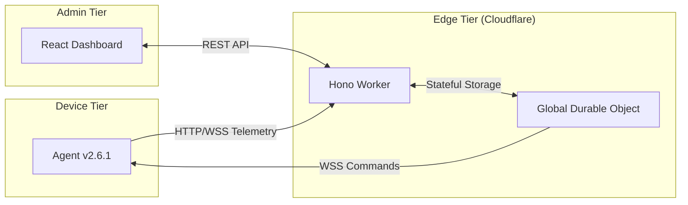

# Technical Architecture: Insidr v2.6
## 1. System Topology
Insidr is built on a serverless, edge-first architecture using the Cloudflare stack.

## 2. Telemetry Ingestion Flow
1. **Agent Hijack:** The agent wraps `fetch` and `console` methods.
2. **Buffer:** Events are stored in a local RAM buffer (LRU).
3. **Transmission:** Data is sent via `CDP-Lite v2` envelope (ACK/SEQ).
4. **Processing:** The Durable Object validates the sequence and updates the "Fleet Pulse".
## 3. Command Sandbox Model
To ensure security, Insidr implements a **Sandboxed Execution Model**:
- Commands dispatched from the UI are queued in the DO.
- The Agent fetches commands via polling or WSS.
- Scripts are executed in a **DedicatedWorker** or a restricted scope, preventing access to sensitive local credentials while allowing hardware-level control (Reload, Clear Cache).
## 4. State Management (Zustand)
The dashboard uses a "Single Source of Truth" pattern with Zustand 5. 
- **Fleet Store:** Manages device metadata and global alert counts.
- **Inspector Store:** Manages per-device logs and metrics with automatic cleanup on unmount.
---
*Security Model: Encrypted Transports + PII Redaction + Sandbox Execution.*